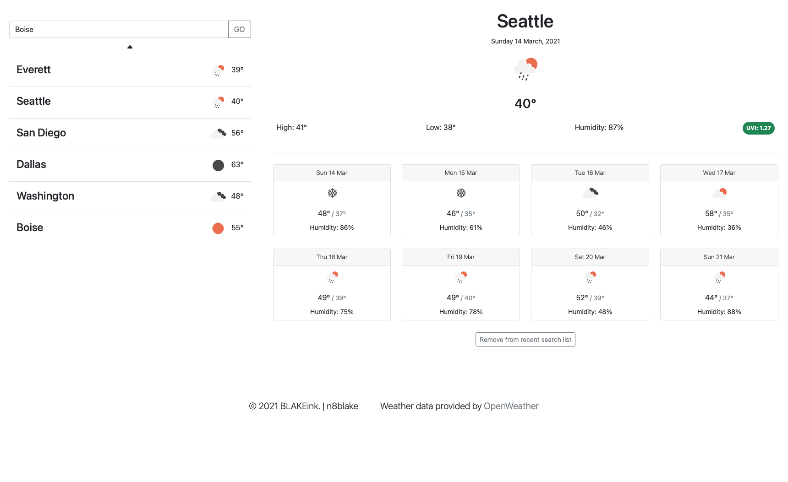

# WeatherApp

A simple app to display the weather. Simply search for a city by typing it into the search field and watch it show up on the page. Past searchs are saved and persist through the use of localStorage.

## In Action 

You can see this project live at: <a href="https://n8blake.github.io/WeatherApp/">https://n8blake.github.io/WeatherApp/</a>

